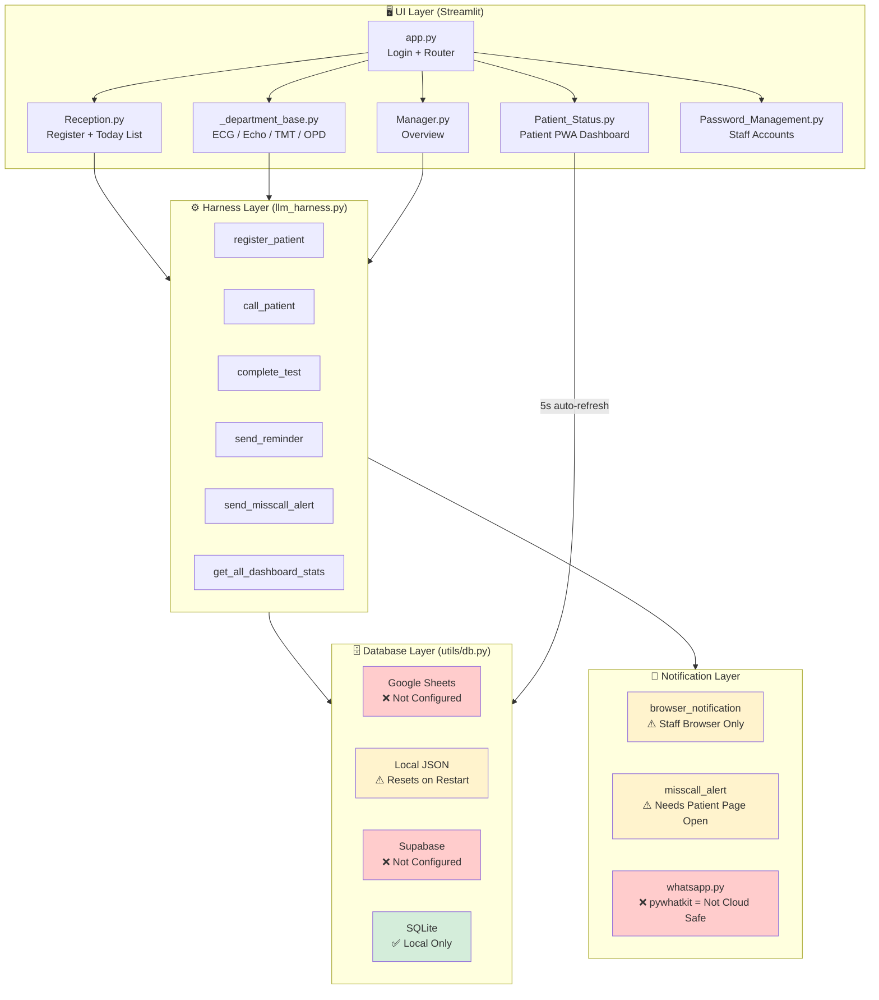

# 🏥 GIL CLINIC — PRODUCT DEVELOPMENT DOCUMENT
## CardioQueue SaaS Platform — Full Technical Blueprint

> **Owner:** Gurjas Singh Gill  
> **Live App:** https://gil-clinic-thuuqqeyt7pawswpcamyhz.streamlit.app/  
> **Document Date:** 2026-07-05  
> **Version:** v2.1 — Post Deep Research  
> **Protocol:** Neural Architect × Harness Engineering × Lego System  

---

## 📋 TABLE OF CONTENTS

1. [Product Vision & Business Model](#1-product-vision--business-model)
2. [Current Architecture — What's Built](#2-current-architecture--whats-built)
3. [Harness Engineering — The Core Concept](#3-harness-engineering--the-core-concept)
4. [System Relationship Map](#4-system-relationship-map)
5. [BRICK 1 — Alert System Fix (CRITICAL)](#5-brick-1--alert-system-fix)
6. [BRICK 2 — UI Premium Redesign](#6-brick-2--ui-premium-redesign)
7. [BRICK 3 — Data Persistence Fix (Google Sheets / Supabase)](#7-brick-3--data-persistence-fix)
8. [BRICK 4 — Appointment Time Display](#8-brick-4--appointment-time-display)
9. [BRICK 5 — Multi-Tenant SaaS Mode](#9-brick-5--multi-tenant-saas-mode)
10. [BRICK 6 — Dynamic Department Management](#10-brick-6--dynamic-department-management)
11. [BRICK 7 — Branding Cleanup (Quick Fix)](#11-brick-7--branding-cleanup)
12. [BRICK 8 — WhatsApp Share & Token Slip](#12-brick-8--whatsapp-share--token-slip)
13. [Execution Roadmap & Timeline](#13-execution-roadmap--timeline)
14. [SaaS Pricing Model](#14-saas-pricing-model)
15. [File Change Master Map](#15-file-change-master-map)

---

## 1. Product Vision & Business Model

### 🎯 What We Are Building

**CardioQueue** is a **Clinic Queue Management SaaS** that starts as GIL CLINIC's internal tool and grows into a **white-label product** sold to:
- Cardiology clinics (current)
- Dental clinics
- Ultrasound / Radiology centers
- General OPD / Multi-specialty clinics
- Diagnostic labs

### 💰 Revenue Model

| Tier | Description | Monthly Price |
|------|-------------|---------------|
| **Free** | Single clinic, 1 doctor, max 20 patients/day | ₹0 |
| **Basic** | Single clinic, unlimited patients, all departments | ₹999/month |
| **Pro** | Up to 3 clinics, custom branding, WhatsApp alerts | ₹2,499/month |
| **Enterprise** | Unlimited clinics, API access, dedicated support | ₹9,999/month |

### 🏆 Unique Value Proposition
> "दवाखाने में कोई लाइन नहीं, सब कुछ mobile पर।"

- Patient को आने की ज़रूरत नहीं जब तक turn नहीं आता
- Staff को WhatsApp/phone पर remind करने की ज़रूरत नहीं
- Doctor को हर patient की history phone पर

---

## 2. Current Architecture — What's Built

### ✅ What Works (Confirmed by Code Review)

```
LAYER 1: UI (Streamlit)
├── app.py               ✅ Login, routing, session management
├── pages/Reception.py   ✅ Patient registration, today's list
├── pages/Patient_Status.py ✅ Self-service dashboard, PWA support
├── pages/_department_base.py ✅ Shared dept dashboard (ECG/Echo/TMT/OPD)
├── pages/Manager.py     ✅ Full clinic overview
├── pages/Doctor.py      ✅ Report delivery
└── pages/Password_Management.py ✅ Admin: staff accounts

LAYER 2: HARNESS (llm_harness.py)
├── register_patient()   ✅ Full validation + DB + notification
├── call_patient()       ✅ Queue management
├── complete_test()      ✅ Status updates
├── send_reminder()      ⚠️ Sends to STAFF browser, not patient
├── send_misscall_alert() ✅ Fixed (patient_pid bug fixed today)
├── get_department_queue() ✅ Queue data
└── get_all_dashboard_stats() ✅ Manager overview

LAYER 3: DATABASE (utils/db.py)
├── Google Sheets mode   ❌ Not configured (GOOGLE_SCRIPT_URL missing)
├── Local JSON mode      ✅ Works but data resets on Streamlit restart
├── Supabase mode        ❌ Not configured (placeholder credentials)
└── SQLite mode          ✅ Works locally only

LAYER 4: NOTIFICATIONS (utils/notifications.py)
├── browser_notification_script()  ⚠️ Only works on STAFF browser
├── misscall_alert_script()        ⚠️ Patient must have page open
├── request_notification_permission_script() ✅ Works
└── BEEP audio engine in Patient_Status.py  ✅ Good architecture

LAYER 5: UTILITIES
├── utils/queue.py       ✅ Wait time calculation
├── utils/whatsapp.py    ❌ pywhatkit (needs WhatsApp Web on device — not cloud-safe)
└── utils/config.py      ⚠️ Many hard-coded values (clinic name, test types)
```

### ❌ Critical Gaps Found

| Gap | Impact | Severity |
|-----|--------|----------|
| Alert reaches staff browser, not patient phone | Core feature broken | 🔴 CRITICAL |
| Data resets on Streamlit Cloud restart | No persistence | 🔴 CRITICAL |
| UI looks basic | Poor SaaS sales conversion | 🟠 HIGH |
| Hard-coded "GIL CLINIC" everywhere | Cannot white-label | 🟡 MEDIUM |
| No multi-tenant system | Cannot sell to other clinics | 🟡 MEDIUM |
| No appointment time shown | Poor patient experience | 🟡 MEDIUM |

---

## 3. Harness Engineering — The Core Concept

### 🔧 What Harness Engineering Means in This App

```
TRADITIONAL APPROACH (Wrong):
UI Page → directly calls DB → directly calls notification
Result: Spaghetti code, hard to maintain, bugs everywhere

HARNESS ENGINEERING (Our Approach — Already Partially Done):
UI Page → Harness → DB / Alerts / Queue Logic
Result: One place to fix things, easy to extend
```

### The Car Analogy (Applied to GIL CLINIC)
```
LLM / Business Rules = Engine (smart decision maker)
llm_harness.py       = Gearbox + Dashboard (orchestrates everything)
utils/db.py          = Fuel Tank (stores data)
utils/notifications.py = Horn + Lights (alerts)
Streamlit pages      = Car Body (what user sees)
```

### Current Harness Health Report

| Module | Status | Notes |
|--------|--------|-------|
| `register_patient()` | ✅ 90% | Works well, good validation |
| `call_patient()` | ✅ 85% | Queue management solid |
| `complete_test()` | ✅ 85% | Status flow correct |
| `send_reminder()` | ❌ 30% | Sends to wrong browser |
| `send_misscall_alert()` | ✅ 80% | Fixed today (patient_pid bug) |
| `get_patient_details()` | ✅ 85% | Works across all DB modes |
| **Alert delivery to patient** | ❌ 0% | Architecture is wrong |
| **Data persistence** | ❌ 20% | Local JSON resets on cloud |

---

## 4. System Relationship Map



### 🔴 The Alert Problem — Visualized

```
CURRENT (BROKEN):
Staff presses "Remind" button
    ↓
Harness.send_reminder() runs
    ↓
JS script is injected into STAFF's Streamlit page ← WRONG BROWSER!
    ↓
Patient's phone: Nothing happens ❌

FIXED APPROACH (Brick 1 Solution):
Staff presses "Remind" button
    ↓
Harness.send_reminder() writes pending_alert=1 to DATABASE
    ↓
Patient's browser auto-refreshes every 5 seconds ← Patient Status page
    ↓
Patient_Status.py reads pending_alert flag from DB
    ↓
Patient's phone: BEEP + VIBRATION + BANNER ✅
```

---

## 5. BRICK 1 — Alert System Fix

### 📁 Problem Location
**File:** `llm_harness.py` → `send_reminder()` method  
**File:** `utils/db.py` → no `pending_alert` column  
**File:** `pages/Patient_Status.py` → needs to check alert flag

### 🛠️ Implementation Plan (Step by Step)

#### Step 1 — DB Change: Add `pending_alert` column to tests table

**File:** `utils/db.py`

In `init_sqlite()`, add column to tests table:
```python
# ADD to tests CREATE TABLE:
pending_alert INTEGER DEFAULT 0,
alert_message TEXT DEFAULT '',
```

Add these new functions to `db.py`:
```python
def set_patient_alert(patient_id: str, message: str = "") -> bool:
    """Set pending_alert=1 for ALL active tests of a patient."""
    # SQLite version
    conn = sqlite3.connect(DB_FILE)
    cursor = conn.cursor()
    cursor.execute(
        "UPDATE tests SET pending_alert=1, alert_message=? WHERE patient_id=?",
        (message, patient_id)
    )
    conn.commit()
    conn.close()
    return True

def get_patient_alert(patient_id: str) -> dict:
    """Check if patient has a pending alert. Returns {has_alert, message}."""
    conn = sqlite3.connect(DB_FILE)
    cursor = conn.cursor()
    cursor.execute(
        "SELECT pending_alert, alert_message FROM tests WHERE patient_id=? AND pending_alert=1 LIMIT 1",
        (patient_id,)
    )
    row = cursor.fetchone()
    conn.close()
    if row:
        return {"has_alert": True, "message": row[1]}
    return {"has_alert": False, "message": ""}

def clear_patient_alert(patient_id: str) -> bool:
    """Clear pending_alert after patient has seen it."""
    conn = sqlite3.connect(DB_FILE)
    cursor = conn.cursor()
    cursor.execute(
        "UPDATE tests SET pending_alert=0, alert_message='' WHERE patient_id=?",
        (patient_id,)
    )
    conn.commit()
    conn.close()
    return True
```

**Also add to Google Sheets API & Local JSON versions for all 3 DB modes.**

#### Step 2 — Harness Change: Fix `send_reminder()`

**File:** `llm_harness.py`

```python
def send_reminder(self, patient_name: str, test_name: str, mobile: str,
                  token: int = 0, patient_id: str = "") -> dict:
    """
    Send reminder — NOW ACTUALLY REACHES PATIENT'S PHONE via DB poll.
    
    Architecture fix: Instead of JS injection on staff browser,
    write pending_alert=1 to DB. Patient's 5s auto-refresh reads it.
    """
    from utils.db import set_patient_alert
    
    msg = (
        f"🔔 आपका नंबर जल्द आने वाला है!\n"
        f"{patient_name} — {test_name}\n"
        f"Token: #{token}\n"
        f"कृपया तैयार रहें!"
    )
    
    # ✅ Write to DB — patient's page will pick this up on next 5s refresh
    if patient_id:
        set_patient_alert(patient_id, msg)
    
    return {
        "success": True,
        "message": f"🔔 Reminder sent to {patient_name} — will appear on their phone within 5 seconds",
        "notification": msg,
    }
```

#### Step 3 — Patient_Status.py: Check alert flag on every refresh

**File:** `pages/Patient_Status.py`

After loading patient data, before rendering cards:
```python
# ─── Check DB for pending staff alert ──────────────────────────────
from utils.db import get_patient_alert, clear_patient_alert
alert_data = get_patient_alert(patient["patient_id"])
if alert_data["has_alert"]:
    clear_patient_alert(patient["patient_id"])  # Clear immediately
    # Inject JS to play sound + vibrate + show banner
    st.markdown(
        get_status_watcher_js(status_hash, patient["name"], patient["patient_id"]),
        unsafe_allow_html=True,
    )
    # Also trigger the alert directly via data attribute
    st.markdown(
        f'<div id="force-alert" data-message="{alert_data["message"]}" '
        f'style="display:none;"></div>',
        unsafe_allow_html=True,
    )
    # Show visible banner on patient page
    st.warning(f"🔔 {alert_data['message']}")
```

Add to the JS status watcher (at the top of `get_status_watcher_js()`):
```javascript
// Check for force-alert element (set by DB poll)
var alertEl = document.getElementById('force-alert');
if (alertEl) {
    var alertMsg = alertEl.getAttribute('data-message') || 'Alert!';
    window.__playPatientAlert(alertMsg);
    alertEl.remove();
}
```

#### Step 4 — Local JSON DB: Add alert support

**File:** `utils/local_json_db.py`

Add `pending_alert` and `alert_message` fields to test records:
```python
test = {
    ...existing fields...
    "pending_alert": 0,
    "alert_message": "",
}
```

Add `set_patient_alert_json()`, `get_patient_alert_json()`, `clear_patient_alert_json()` functions.

#### ✅ Result After Brick 1
```
Staff presses Remind → DB gets pending_alert=1
                     ↓ (max 5 seconds)
Patient's page auto-refreshes → reads pending_alert=1 → BEEP + VIBRATE + BANNER
                     ↓
DB gets pending_alert=0 (cleared)
```
**Patient experience: Sound + Vibration + Visual banner within 5 seconds of staff pressing Remind. No WhatsApp needed. No notification permission needed.**

---

## 6. BRICK 2 — UI Premium Redesign

### 📁 Files to Change
- `assets/style.css` — Full rewrite (primary)
- `app.py` → `render_login_page()` — Redesign
- `pages/Patient_Status.py` → Test cards — Redesign
- `pages/_department_base.py` → Stats row — Redesign

### 🎨 Design System

#### Color Palette (Dark Medical Theme)
```css
--primary:    #667eea;   /* Periwinkle blue */
--secondary:  #764ba2;   /* Deep purple */
--accent:     #f093fb;   /* Pink accent */
--success:    #00b894;   /* Mint green */
--warning:    #fdcb6e;   /* Warm yellow */
--danger:     #fd79a8;   /* Soft red */
--bg-dark:    #0f0f1a;   /* Deep navy */
--bg-card:    rgba(255,255,255,0.05);  /* Glass */
--border:     rgba(255,255,255,0.1);  /* Glass border */
```

#### Typography
```css
@import url('https://fonts.googleapis.com/css2?family=Inter:wght@300;400;600;700;800&display=swap');
font-family: 'Inter', -apple-system, sans-serif;
```

#### Key Visual Elements to Add
1. **Glassmorphism cards** — `backdrop-filter: blur(10px)` + `background: rgba(255,255,255,0.05)`
2. **Gradient text** for headings
3. **Pulsing dot** for live status
4. **Animated status badges** — color-coded with glow
5. **Smooth hover transitions** — `transform: translateY(-2px)` on cards
6. **Loading skeleton** for data fetching states

#### Login Page Redesign Spec
```
CURRENT:
- 3 columns, basic form
- Default Streamlit buttons
- No background

TARGET:
- Full-screen gradient background (#0f0f1a → #1a1a2e)
- Center card with glassmorphism
- Hospital logo emoji (big, animated)
- Staff cards with avatar circles + hover glow
- PIN entry with large dots (like bank ATM)
- Smooth transitions between steps
```

#### Patient Status Card Redesign Spec
```
CURRENT:
- Plain st.container(border=True)
- Text-only status

TARGET:
- Full-width colored gradient card per test
- Large status emoji with pulsing animation when "called"
- Progress steps visual (1→2→3→4→5→6)
- Estimated time in big bold numbers
- Room info with location pin icon
```

### 🔗 Key Dependencies for Brick 2
- Brick 7 (branding cleanup) should be done first or simultaneously
- No DB changes needed for UI redesign

---

## 7. BRICK 3 — Data Persistence Fix

### 📁 The Problem — Exactly

**On Streamlit Cloud:**
- App uses `cardioqueue_data/` local JSON files
- Streamlit Cloud has **ephemeral filesystem** — every restart/redeploy wipes files
- All patient data is lost
- `cardioqueue.db` (SQLite) same issue

**The `.env` file currently:**
```env
SUPABASE_URL=https://your-project-id.supabase.co   ← placeholder!
SUPABASE_KEY=your-supabase-anon-key                 ← placeholder!
# GOOGLE_SCRIPT_URL is not even in .env             ← missing!
```

### 🛠️ Two Options — Pick One

#### Option A: Supabase (RECOMMENDED — Easier, More Reliable)

**Why Supabase:**
- Free tier: 500MB storage, 50,000 active users/month
- Already coded in `utils/db.py` — just needs credentials
- `supabase_schema.sql` already exists in project
- Real-time capabilities for future features
- No Google account complexity

**Steps:**
1. Go to https://supabase.com → Create free project → Copy project URL and anon key
2. Open `supabase_schema.sql` → Run in Supabase SQL Editor
3. Update Streamlit Cloud Secrets:
   ```toml
   SUPABASE_URL = "https://abcdef.supabase.co"
   SUPABASE_KEY = "eyJhbGciO..."
   BASE_URL = "https://gil-clinic-thuuqqeyt7pawswpcamyhz.streamlit.app"
   HOSPITAL_NAME = "GIL CLINIC"
   ADMIN_USERNAME = "admin"
   ADMIN_PASS = "gurjas@123"
   ```
4. Redeploy → data now persists forever

**Code change in `utils/db.py`:**
- Add `pending_alert` and `alert_message` columns to Supabase schema
- Add corresponding Supabase versions of alert functions

#### Option B: Google Sheets (Patient's Own Data in Their Google Account)

**Why Google Sheets:**
- Patient/clinic owner can see ALL data in their own Google Sheet
- Free forever (Google Drive storage)
- Easy to export, share, backup
- Non-technical clinic owners can view/edit directly

**Steps:**
1. Copy the Google Apps Script template (see below)
2. Deploy as Web App → copy the URL
3. Add to Streamlit Secrets: `GOOGLE_SCRIPT_URL = "https://script.google.com/..."`

**Google Apps Script Required Functions:**
```javascript
function doGet(e) {
  var action = e.parameter.action;
  var sheet = SpreadsheetApp.getActiveSpreadsheet();
  
  if (action === "createPatient") { return createPatient(e, sheet); }
  if (action === "getTodayPatients") { return getTodayPatients(sheet); }
  if (action === "getPatientById") { return getPatientById(e, sheet); }
  if (action === "createTest") { return createTest(e, sheet); }
  if (action === "updateTestStatus") { return updateTestStatus(e, sheet); }
  if (action === "setPatientAlert") { return setPatientAlert(e, sheet); }   ← NEW
  if (action === "getPatientAlert") { return getPatientAlert(e, sheet); }   ← NEW
  if (action === "clearPatientAlert") { return clearPatientAlert(e, sheet); } ← NEW
  // ... all other actions
}
```

**Required Google Sheet Tabs:**
| Tab Name | Columns |
|----------|---------|
| `patients` | id, patient_id, name, mobile, age, gender, registration_date, created_at |
| `tests` | id, patient_id, test_name, status, token_number, queue_position, room, called_at, started_at, completed_at, report_ready_at, delivered_at, created_at, **pending_alert**, **alert_message** |
| `messages` | id, patient_id, mobile, message_type, message_text, sent_at |
| `users` | id, username, display_name, role, password, active, created_at |
| `counters` | test_name, count |

### 📝 Code Changes Required in db.py for Brick 3

```python
# New functions to add at bottom of db.py:

def set_patient_alert(patient_id: str, message: str = "") -> bool:
    """DB-agnostic: set pending alert for patient."""
    if USE_GOOGLE_SHEETS and not _gs_failed:
        call_gs_api("setPatientAlert", {"patientId": patient_id, "message": message}, is_post=True)
        return True
    if USE_LOCAL_JSON:
        return _set_patient_alert_json(patient_id, message)
    if USE_SUPABASE:
        get_client().table("tests").update(
            {"pending_alert": 1, "alert_message": message}
        ).eq("patient_id", patient_id).execute()
        return True
    else:  # SQLite
        conn = sqlite3.connect(DB_FILE)
        conn.execute("UPDATE tests SET pending_alert=1, alert_message=? WHERE patient_id=?",
                     (message, patient_id))
        conn.commit(); conn.close()
        return True
```

---

## 8. BRICK 4 — Appointment Time Display

### 📁 Files to Change
- `utils/queue.py` → add `calculate_expected_time()`
- `pages/Patient_Status.py` → show clock time on test cards
- `llm_harness.py` → `generate_token_slip()` → add time to slip
- `pages/Reception.py` → WhatsApp share button

### 🛠️ Implementation Plan

#### New function in `utils/queue.py`
```python
from datetime import datetime, timedelta

def calculate_expected_time(test_name: str, queue_position: int) -> str:
    """
    Returns estimated appointment time as a clock string.
    Example: "~3:45 PM"
    """
    wait_minutes = calculate_wait_time(test_name, queue_position)
    if wait_minutes <= 0:
        return "Now / अभी"
    expected = datetime.now() + timedelta(minutes=wait_minutes)
    # Format: 3:45 PM
    return expected.strftime("~%-I:%M %p")  # Linux/Mac
    # Windows: expected.strftime("~%I:%M %p").lstrip("0")
```

#### Patient Status Card Update
```
CURRENT DISPLAY:
┌─────────────────────────┐
│ ECG          ⏱️ ~20 min │
│ 🟡 Waiting               │
│ Position: #3            │
└─────────────────────────┘

TARGET DISPLAY:
┌─────────────────────────┐
│ ECG          📅 ~3:45 PM │
│ 🟡 Waiting               │
│ Position: #3 | ~20 min  │
│ [📤 WhatsApp पर Share]  │
└─────────────────────────┘
```

#### WhatsApp Share Button (Reception.py)
```python
# wa.me deep link — no API needed, works on any phone
wa_msg = urllib.parse.quote(
    f"🏥 *{HOSPITAL_NAME}*\n"
    f"Patient: {p_name}\n"
    f"Token: #{token}\n"
    f"Expected time: {expected_time}\n"
    f"📱 Track live: {BASE_URL}/?patient={p_id}"
)
wa_url = f"https://wa.me/91{p_mobile}?text={wa_msg}"
st.markdown(f'<a href="{wa_url}" target="_blank">📤 WhatsApp पर भेजो</a>', unsafe_allow_html=True)
```

#### Token Slip Update
```
CURRENT TOKEN SLIP:
━━━━━━━━━━━━━━━━━━━━━━━━━━━━━━━
     GIL CLINIC
━━━━━━━━━━━━━━━━━━━━━━━━━━━━━━━
Token: CQ-20260705-001
Patient: Ramesh Kumar
Date: 05-Jul-2026
Tests: 001 ECG — ECG Room 1

TARGET TOKEN SLIP:
━━━━━━━━━━━━━━━━━━━━━━━━━━━━━━━
     GIL CLINIC
━━━━━━━━━━━━━━━━━━━━━━━━━━━━━━━
Patient: Ramesh Kumar
Token: CQ-20260705-001  
Date: 05-Jul-2026

TESTS & ESTIMATED TIMES:
  ECG  →  Room 1  →  ~3:15 PM
  Echo →  Room 2  →  ~3:40 PM
  OPD  →  Room 3  →  ~4:10 PM

📱 Live Status: [QR CODE]
WhatsApp: 8800XXXXXX
```

---

## 9. BRICK 5 — Multi-Tenant SaaS Mode

### 📁 Architecture Required

This is the most complex brick. It requires a **Clinic Management System** on top of everything.

#### New Database Table: `clinic_settings`
```sql
CREATE TABLE clinic_settings (
    id TEXT PRIMARY KEY,
    clinic_id TEXT UNIQUE NOT NULL,    -- e.g. "gil_clinic", "dental_abc"
    clinic_name TEXT NOT NULL,         -- "GIL CLINIC"
    specialty TEXT NOT NULL,           -- "Cardiology"
    departments TEXT NOT NULL,         -- JSON: ["ECG","Echo","OPD"]
    logo_emoji TEXT DEFAULT '🏥',
    logo_url TEXT DEFAULT '',
    phone TEXT DEFAULT '',
    address TEXT DEFAULT '',
    owner_username TEXT NOT NULL,      -- Who created this clinic
    owner_email TEXT DEFAULT '',
    plan_type TEXT DEFAULT 'basic',    -- free/basic/pro/enterprise
    is_active INTEGER DEFAULT 1,
    created_at TEXT NOT NULL
);
```

#### New Admin Panel Tab: ⚙️ Clinic Settings
```
Tab location: pages/Password_Management.py → add 6th tab

Tab content:
├── Clinic Name (text input)
├── Specialty (e.g. "Cardiology", "Dental", "Radiology")
├── Departments (multiselect from master list)
├── Logo Emoji (emoji picker)
├── Phone & Address
├── [💾 Save Settings] button
└── Preview: "How patients will see your clinic"
```

#### Dynamic Config Loading
**File:** `utils/config.py`

```python
def get_clinic_settings() -> dict:
    """Load clinic settings from DB, fall back to .env defaults."""
    try:
        from utils.db import get_clinic_settings_db
        settings = get_clinic_settings_db()
        if settings:
            return settings
    except Exception:
        pass
    # Fallback to .env
    return {
        "clinic_name": os.getenv("HOSPITAL_NAME", "GIL CLINIC"),
        "specialty": os.getenv("CLINIC_SPECIALTY", "Cardiology"),
        "departments": os.getenv("TEST_TYPES", "ECG,Echo,TMT,OPD").split(","),
        "logo_emoji": os.getenv("CLINIC_LOGO", "🏥"),
    }

# Dynamic TEST_TYPES (replaces hard-coded list)
_clinic = get_clinic_settings()
TEST_TYPES = _clinic.get("departments", ["ECG", "Echo", "TMT", "OPD"])
HOSPITAL_NAME = _clinic.get("clinic_name", "GIL CLINIC")
CLINIC_SPECIALTY = _clinic.get("specialty", "Cardiology")
CLINIC_LOGO = _clinic.get("logo_emoji", "🏥")
```

#### Multi-Clinic Deployment Options

**Option A: Single App, Multiple Clinic Configs (Simple)**
- One Streamlit app
- Admin sets clinic via `.env` or Streamlit secrets
- Each clinic gets their own Streamlit Cloud deployment (free)
- Each clinic has their own Supabase project or Google Sheet
- **Cost for clinic owner: ₹0 (free hosting)**

**Option B: Single App, Multi-tenant (Advanced)**
- One app, multiple clinics in one DB
- Login screen shows: "Which clinic?" → then staff login
- Requires subdomain routing or URL params
- More complex but one deployment for you to manage
- **Better for SaaS business, but complex to build**

**Recommendation: Start with Option A → Move to Option B when you have 5+ paying clinics**

---

## 10. BRICK 6 — Dynamic Department Management

### 📁 Files to Change
- `utils/config.py` → `TEST_TYPES` → make dynamic
- `app.py` → `ROLE_PAGES`, `DEPARTMENT_PAGES` → build from `TEST_TYPES`
- `pages/Password_Management.py` → add department management tab

### 🛠️ Implementation Plan

#### Admin Panel: Manage Departments Tab
```python
# In Password_Management.py, add new tab:
with tab_depts:
    st.markdown("### 🏥 Manage Departments")
    
    # Current departments
    current_depts = get_active_departments()  # from DB
    
    # Add new department
    new_dept_name = st.text_input("Department Name", placeholder="e.g. Ultrasound")
    new_dept_avg_time = st.number_input("Avg Time (minutes)", min_value=5, max_value=120, value=15)
    new_dept_room = st.text_input("Room Name", placeholder="e.g. Ultrasound Room 1")
    
    if st.button("➕ Add Department"):
        add_department(new_dept_name, new_dept_avg_time, new_dept_room)
        st.success(f"✅ {new_dept_name} department added!")
        st.rerun()
    
    # List and remove existing
    for dept in current_depts:
        col1, col2, col3 = st.columns([3, 2, 1])
        col1.markdown(f"**{dept['name']}**")
        col2.caption(f"~{dept['avg_time']} min | {dept['room']}")
        if col3.button("❌", key=f"remove_{dept['name']}"):
            remove_department(dept['name'])
            st.rerun()
```

#### Dynamic Routing in app.py
```python
# Replace hard-coded DEPARTMENT_PAGES with dynamic version:
from utils.config import TEST_TYPES

DEPARTMENT_PAGES = {dept: f"📊 {dept}" for dept in TEST_TYPES}
# OPD gets special icon:
if "OPD" in DEPARTMENT_PAGES:
    DEPARTMENT_PAGES["OPD"] = "🩺 OPD"
```

---

## 11. BRICK 7 — Branding Cleanup (Quick Fix)

### 📁 Changes Required (5 files, ~10 minutes)

#### `utils/config.py` — Add new variable
```python
CLINIC_SPECIALTY = os.getenv("CLINIC_SPECIALTY", "Cardiology")
CLINIC_LOGO = os.getenv("CLINIC_LOGO", "🏥")
```

#### `app.py` — 4 hard-coded strings to fix

| Line | Current | Fix |
|------|---------|-----|
| 14 | `page_title="CardioQueue — GIL CLINIC"` | `page_title=f"{APP_NAME} — {HOSPITAL_NAME}"` |
| 153 | `"GIL CLINIC — Cardiology Department"` | `f"{HOSPITAL_NAME} — {CLINIC_SPECIALTY} Department"` |
| 391 | `"Cardiology Department"` | `f"{CLINIC_SPECIALTY} Department"` |
| 438 | `"A lightweight patient flow management system for cardiology departments."` | `f"A smart queue management system for {CLINIC_SPECIALTY} departments."` |

#### `pages/Patient_Status.py` — 1 hard-coded string
| Line | Current | Fix |
|------|---------|-----|
| 373 | `st.title("❤️ Cardio Department")` | `st.title(f"{CLINIC_LOGO} {CLINIC_SPECIALTY} Department")` |

#### `.env` — Add new variable
```env
CLINIC_SPECIALTY=Cardiology
CLINIC_LOGO=🏥
```

#### Streamlit Cloud Secrets — Add
```toml
CLINIC_SPECIALTY = "Cardiology"
CLINIC_LOGO = "🏥"
```

---

## 12. BRICK 8 — WhatsApp Share & Token Slip

### 📁 Files to Change
- `llm_harness.py` → `generate_token_slip()`
- `pages/Reception.py` → Add WhatsApp share button
- `pages/Patient_Status.py` → Add share link button

### 🛠️ Implementation Plan

#### Why NOT use `whatsapp.py` (pywhatkit)
`pywhatkit` uses WhatsApp Web browser automation (`pyautogui`). On Streamlit Cloud:
- No display/screen available
- Cannot open Chrome browser
- **Will crash the app**

**Better approach: `wa.me` deep links** (zero code, works everywhere)

#### WhatsApp Deep Link Button (Reception.py)
```python
import urllib.parse

# After patient registration or in Today's Patient list:
est_time = calculate_expected_time(test_names[0], 1)  # First test
wa_text = urllib.parse.quote(
    f"🏥 *{HOSPITAL_NAME}*\n"
    f"━━━━━━━━━━━━━━━\n"
    f"📛 Patient: *{p_name}*\n"
    f"🎫 Token: *{p_id}*\n"
    f"📅 Date: {date.today().strftime('%d-%b-%Y')}\n"
    f"⏰ Expected: *{est_time}*\n"
    f"━━━━━━━━━━━━━━━\n"
    f"📱 Live status track karein:\n{BASE_URL}/?patient={p_id}"
)
wa_link = f"https://wa.me/91{p_mobile}?text={wa_text}"
st.markdown(
    f'<a href="{wa_link}" target="_blank" style="..gradient button style..">'
    f'📲 WhatsApp पर भेजो</a>',
    unsafe_allow_html=True
)
```

#### Share Status Link Button (Patient_Status.py)
```python
# Add at top of patient status page:
share_url = f"{BASE_URL}/?patient={patient['patient_id']}"
st.markdown(f"""
<div style="text-align:center; margin: 8px 0;">
    <button onclick="
        if(navigator.share) {{
            navigator.share({{title:'My Status', url:'{share_url}'}});
        }} else {{
            navigator.clipboard.writeText('{share_url}');
            this.innerText = '✅ Link Copied!';
        }}"
        style="...gradient button...">
        🔗 Status Link Share करो
    </button>
</div>
""", unsafe_allow_html=True)
```

#### Token Slip Enhancement (`llm_harness.py`)
```python
def generate_token_slip(self, patient_name: str, patient_id: str, tests: list) -> str:
    from datetime import datetime, timedelta
    from utils.queue import calculate_wait_time
    
    lines = [
        "=" * 42,
        f"  {self.hospital}",
        f"  {CLINIC_SPECIALTY} Department",
        "=" * 42,
        f"  Patient: {patient_name}",
        f"  Token:   {patient_id}",
        f"  Date:    {date.today().strftime('%d-%b-%Y %I:%M %p')}",
        "-" * 42,
        "  TESTS & ESTIMATED TIMES:",
        "",
    ]
    for i, t in enumerate(tests):
        est_mins = calculate_wait_time(t['test_name'], i + 1)
        est_time = (datetime.now() + timedelta(minutes=est_mins)).strftime("%I:%M %p")
        lines.append(f"  {t['test_name']:8} → {t.get('room','Room 1'):12} → ~{est_time}")
    
    lines += [
        "",
        "-" * 42,
        f"  📱 Live Status: {BASE_URL}/?patient={patient_id}",
        "  कृपया अपनी बारी का इंतज़ार करें",
        "  Please wait for your turn.",
        "=" * 42,
    ]
    return "\n".join(lines)
```

---

## 13. Execution Roadmap & Timeline

### 🗓️ Phase 1 — Foundation (2-3 days of work)

```
DAY 1:
  Morning: BRICK 7 (branding cleanup — 10 min)
  Morning: BRICK 3 (Supabase setup — 30 min)
  Afternoon: BRICK 1 (Alert system fix — 2-3 hours)
  Evening: Test BRICK 1 on live app

DAY 2:
  BRICK 2 (UI redesign — 3-4 hours)
  Test on mobile

DAY 3:
  BRICK 4 (Appointment time + WhatsApp share — 2 hours)
  BRICK 8 (Token slip + share button — 1 hour)
```

### 🗓️ Phase 2 — SaaS (1 week)
```
WEEK 2:
  BRICK 6 (Dynamic departments — 1 day)
  BRICK 5 (Multi-tenant / white-label — 2-3 days)
  Testing with 1 real other clinic
```

### 🗓️ Phase 3 — Scale (Month 2+)
```
  WhatsApp Business API integration (real alerts via API)
  Analytics dashboard for clinic owners
  Monthly report generation
  Payment gateway (Razorpay)
  Mobile app (Progressive Web App polish)
```

---

## 14. SaaS Pricing Model

### 💰 How You Sell to Clinics

**Per-clinic deployment on Streamlit Cloud (Free)**

Every clinic you sell to gets:
1. Their own Streamlit Cloud deployment (free from Streamlit)
2. Their own Supabase database (free tier)
3. Custom `HOSPITAL_NAME`, `CLINIC_SPECIALTY`, `DEPARTMENTS` configured

**Your maintenance fee: ₹999-₹2,499/month per clinic**

For that you provide:
- Setup + training: ₹5,000 one-time
- Monthly: bug fixes, updates, new features
- WhatsApp: quick support

**Revenue projections:**
| Clinics | Monthly Revenue |
|---------|----------------|
| 5 clinics | ₹5,000 - ₹12,500 |
| 10 clinics | ₹10,000 - ₹25,000 |
| 25 clinics | ₹25,000 - ₹62,500 |
| 50 clinics | ₹50,000 - ₹1,25,000 |

**Target niches (easy sells):**
1. Cardiologists (your GIL CLINIC base)
2. Dental clinics (high turnover, need queue management)
3. Ultrasound centers (few departments, perfect fit)
4. Pathology labs (sample tracking use case)
5. Eye clinics (optometry + OPD)

---

## 15. File Change Master Map

### Summary of All Changes Required

| File | BRICK | Change Type | Effort |
|------|-------|-------------|--------|
| `utils/db.py` | 1, 3, 5 | Add alert functions, Supabase columns | 2-3 hrs |
| `utils/local_json_db.py` | 1, 3 | Add alert functions to JSON mode | 1 hr |
| `llm_harness.py` | 1, 4, 8 | Fix send_reminder, add time, enhance slip | 1-2 hrs |
| `pages/Patient_Status.py` | 1, 4, 8 | Read alert flag, show time, share button | 1-2 hrs |
| `pages/Reception.py` | 4, 8 | WhatsApp share button, estimated time | 1 hr |
| `assets/style.css` | 2 | Full premium rewrite | 2-3 hrs |
| `app.py` | 2, 7 | UI redesign, branding fix | 2-3 hrs |
| `pages/_department_base.py` | 2 | Gradient cards | 1 hr |
| `utils/config.py` | 5, 6, 7 | Dynamic settings, new variables | 1 hr |
| `pages/Password_Management.py` | 5, 6 | Clinic settings tab, dept management | 2-3 hrs |
| `utils/queue.py` | 4 | Add `calculate_expected_time()` | 30 min |
| `supabase_schema.sql` | 3, 5 | Add alert columns, clinic_settings table | 30 min |
| `.env` | 3, 7 | Add SUPABASE creds, CLINIC_SPECIALTY | 5 min |
| Streamlit Cloud Secrets | 3 | Set all environment variables | 10 min |

### New Files to Create

| File | Purpose | BRICK |
|------|---------|-------|
| `utils/clinic_settings.py` | Clinic config management | 5 |
| `assets/style.css` (rewrite) | Premium UI theme | 2 |
| Google Apps Script (external) | Google Sheets backend | 3 (Option B) |

---

## 🎯 Strategic Recommendations (Pro Tips)

### 1. Start with Supabase, Not Google Sheets
Supabase is already coded in `db.py`. Getting it working is a 30-minute task. Google Sheets requires building a full Apps Script backend. Do Supabase first.

### 2. Alert System is the USP
The "staff reminds → patient's phone beeps" feature is what will sell this product. Make it flawless in Brick 1. Demo it live when selling to clinics.

### 3. Mobile-First UI is Non-Negotiable
85% of your users (patients and staff) will be on phones. Every UI decision should be tested on a phone screen first.

### 4. Keep It Simple for Now (One Clinic = One Deploy)
Don't build complex multi-tenant SaaS right away. Manually deploy for each new clinic. Once you have 10+ clients, then invest in automated multi-tenant system.

### 5. The WhatsApp Number is Gold
Collect patient mobile numbers (you already do). Build a WhatsApp Business Account to send appointment reminders. This alone justifies the monthly fee for clinics.

---

## 🔗 Relationship Map (How All Bricks Connect)

```
BRICK 7 (Branding)
    └─→ Enables BRICK 5 (SaaS white-labeling)

BRICK 3 (Data Persistence)
    └─→ Required for BRICK 1 (Alert System) to work on cloud
    └─→ Required for BRICK 5 (Multi-tenant) to store clinic settings

BRICK 1 (Alert Fix)
    └─→ Requires BRICK 3 (DB must persist alerts)
    └─→ Powers BRICK 5 (each clinic gets real alerts)

BRICK 4 (Appointment Time)
    └─→ Enables BRICK 8 (share appointment via WhatsApp)

BRICK 6 (Dynamic Departments)
    └─→ Required for BRICK 5 (each clinic has their own departments)

BRICK 2 (UI Redesign)
    └─→ Powers BRICK 5 (beautiful UI = easier SaaS sales)
    └─→ Independent — can be done any time
```

---

*Document Complete | Ready for Review*  
*GIL CLINIC CardioQueue v2.1 — Neural Architect Protocol Active* 🎯
