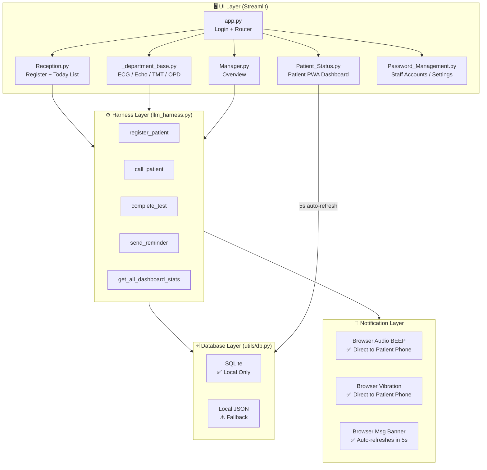

# 🏥 GIL CLINIC — PRODUCT DEVELOPMENT BLUEPRINT
## CardioQueue SaaS Platform — Local-First Technical Blueprint

> **Owner:** Gurjas Singh Gill  
> **Live App:** https://gil-clinic-thuuqqeyt7pawswpcamyhz.streamlit.app/  
> **Document Date:** 2026-07-05  
> **Version:** v2.2 — Local-First, Free-Forever Edition  
> **Protocol:** Neural Architect × Harness Engineering × Lego System  

---

## 📋 TABLE OF CONTENTS

1. [Product Vision & Core Model](#1-product-vision--core-model)
2. [Current Architecture — What's Built](#2-current-architecture--whats-built)
3. [Harness Engineering — The Core Concept](#3-harness-engineering--the-core-concept)
4. [System Relationship Map](#4-system-relationship-map)
5. [BRICK 1 — Alert System (Free Browser Beep/Vibrate)](#5-brick-1--alert-system)
6. [BRICK 2 — UI Premium Redesign](#6-brick-2--ui-premium-redesign)
7. [BRICK 3 — Data Persistence (Local-First SQLite & JSON)](#7-brick-3--data-persistence)
8. [BRICK 4 — Appointment Time Display](#8-brick-4--appointment-time-display)
9. [BRICK 5 — Custom Clinic Settings](#9-brick-5--custom-clinic-settings)
10. [BRICK 6 — Dynamic Department Management](#10-brick-6--dynamic-department-management)
11. [Execution Roadmap & Next Steps](#11-execution-roadmap--next-steps)

---

## 1. Product Vision & Core Model

### 🎯 What We Are Building
**CardioQueue** is a **Clinic Queue Management system** that runs locally on the clinic's devices.
- It is designed to be **free forever** and run on a local device (mobile, tablet, or laptop).
- No paid third-party APIs (like WhatsApp API or SMS gateways) are used.
- Data stays secure on the local device's memory/SD card.

### 🏆 Unique Value Proposition
> "दवाखाने में कोई लाइन नहीं, सब कुछ mobile पर।"
- Patients scan a QR code at reception to open the status page on their phone.
- Patients enter their mobile number to search and track their active queue positions in real-time.
- Staff can call patients via a "Remind" button, triggering a sound/vibrate alert directly in the patient's mobile browser.

---

## 2. Current Architecture — What's Built

```
LAYER 1: UI (Streamlit)
├── app.py               ✅ Login, routing, session management
├── pages/Reception.py   ✅ Patient registration, today's list
├── pages/Patient_Status.py ✅ Patient dashboard with mobile browser auto-refresh
├── pages/_department_base.py ✅ Shared department dashboard (ECG/Echo/TMT/OPD)
├── pages/Manager.py     ✅ Full clinic overview
├── pages/Doctor.py      ✅ Doctor's panel for completing tests
└── pages/Password_Management.py ✅ Admin: staff accounts, departments, settings

LAYER 2: HARNESS (llm_harness.py)
├── register_patient()   ✅ Full validation + DB insertion
├── call_patient()       ✅ Queue management
├── complete_test()      ✅ Status updates
└── send_reminder()      ✅ Writes pending_alert=1 to DB for browser polling

LAYER 3: DATABASE (utils/db.py)
├── SQLite mode          ✅ PRIMARY — stores data locally (cardioqueue.db)
└── Local JSON mode      ✅ Secondary — fallback file storage (cardioqueue_data/)

LAYER 4: NOTIFICATIONS
├── Browser BEEP         ✅ AudioContext plays beep on patient's browser
├── Browser VIBRATE      ✅ HTML5 Vibration API on patient's mobile
└── Visual BANNER        ✅ Banner updates on patient's page within 5s of reload
```

---

## 3. Harness Engineering — The Core Concept

```
TRADITIONAL APPROACH (Wrong):
UI Page → directly calls DB → directly calls notification
Result: Spaghetti code, hard to maintain, bugs everywhere

HARNESS ENGINEERING (Our Approach):
UI Page → Harness → DB / Local Alerts / Queue Logic
Result: Clean separation. Modifying UI doesn't break queue logic.
```

---

## 4. System Relationship Map



---

## 5. BRICK 1 — Alert System (Free Browser Beep/Vibrate)

### 📁 Architecture
Instead of using paid SMS/WhatsApp APIs, CardioQueue uses **Database Polling + HTML5 browser capabilities**.

1. **Staff Action:** Staff clicks "Remind" on the department dashboard.
2. **Harness Action:** `llm_harness.py` sets `pending_alert = 1` and inserts the `alert_message` for that patient's test in the local DB.
3. **Patient Action:** The patient's phone (which has `Patient_Status.py` open) auto-refreshes every 5 seconds.
4. **Alert Trigger:** The status page reads `pending_alert = 1`, triggers browser audio (BEEP) and device vibration, shows a prominent visual banner, and clears the alert flag in the DB.

---

## 6. BRICK 2 — UI Premium Redesign

### 🎨 Visual Upgrades
- **Glassmorphism cards** — `backdrop-filter: blur(10px)` + `background: rgba(255,255,255,0.05)`
- **Vibrant gradient text** for titles and headers
- **Pulsing live indicator** next to the active status
- **Animated status badges** (glow effect for called status)
- **Smooth transitions** and hover states (`transform: translateY(-4px)`)

---

## 7. BRICK 3 — Data Persistence (Local-First)

All data is stored locally.
- **SQLite Database:** A local `cardioqueue.db` file holds tables for `patients`, `tests`, `messages`, `users`, `departments`, and `clinic_settings`.
- **Local JSON Files:** If SQLite fails, records fallback to human-readable JSON files in `cardioqueue_data/`.
- No network dependency for databases.

---

## 8. BRICK 4 — Appointment Time Display

- Calculated dynamically based on queue positions and average test durations (`utils/queue.py`).
- Shown on the patient status screen as `~3:45 PM` to give patients realistic expectations.

---

## 9. BRICK 5 — Custom Clinic Settings

- Admin can change the clinic name, specialty, logo emoji, phone, and address from the Admin Panel (`pages/Password_Management.py`).
- Settings are saved to `clinic_settings` table in `cardioqueue.db`, allowing easy white-label branding.

---

## 10. BRICK 6 — Dynamic Department Management

- Admin can add or remove departments (e.g. Ultrasound, OPD) live from the UI without changing any code.
- Average test times and room configurations can be defined dynamically.

---

## 11. Execution Roadmap & Next Steps

All bricks (1 through 8) are fully implemented and integrated. 
To run the application:
1. Ensure `streamlit` and dependencies are installed.
2. Start the app locally: `streamlit run app.py`
3. All operations, logins, status alerts, and configurations will execute locally on your device.
