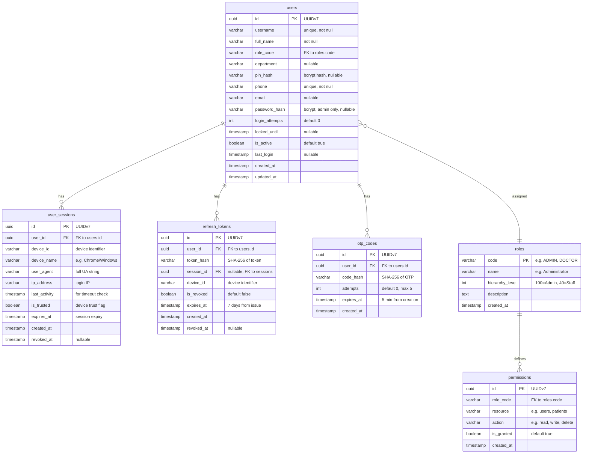

# 002 — Identity Engine: Database Design

*PostgreSQL 16 schema, SQLAlchemy 2.0 models, indexing strategy.*

---

## 1. Entity Overview

The Identity Engine uses 6 tables:

| Table | Purpose | Aggregate |
|---|---|---|
| `identity.users` | Staff users | User |
| `identity.roles` | Role definitions | Role |
| `identity.permissions` | Permission assignments | Permission |
| `identity.user_sessions` | Active sessions | Session |
| `identity.refresh_tokens` | Refresh token store (separate aggregate) | RefreshToken |
| `identity.otp_codes` | OTP codes (ephemeral) | OTP |

All tables use UUIDv7 primary keys (time-sortable, index-friendly).

---

## 2. Entity Relationship Diagram (Mermaid)



---

## 3. Table Definitions

### 3.1 `identity.users`

```sql
CREATE TABLE identity.users (
    id UUID PRIMARY KEY DEFAULT gen_random_uuid(),
    username VARCHAR(100) UNIQUE NOT NULL,
    full_name VARCHAR(200) NOT NULL,
    role_code VARCHAR(20) NOT NULL REFERENCES identity.roles(code),
    department VARCHAR(100),
    pin_hash VARCHAR(255),
    phone VARCHAR(20) UNIQUE NOT NULL,
    email VARCHAR(255),
    password_hash VARCHAR(255),
    login_attempts INTEGER DEFAULT 0,
    locked_until TIMESTAMPTZ,
    is_active BOOLEAN DEFAULT TRUE,
    last_login TIMESTAMPTZ,
    created_at TIMESTAMPTZ NOT NULL DEFAULT NOW(),
    updated_at TIMESTAMPTZ NOT NULL DEFAULT NOW()
);

CREATE INDEX idx_users_role ON identity.users(role_code);
CREATE INDEX idx_users_department ON identity.users(department);
CREATE INDEX idx_users_phone ON identity.users(phone);
CREATE INDEX idx_users_active ON identity.users(is_active) WHERE is_active = TRUE;
```

### 3.2 `identity.roles`

```sql
CREATE TABLE identity.roles (
    code VARCHAR(20) PRIMARY KEY,
    name VARCHAR(100) NOT NULL,
    hierarchy_level INTEGER NOT NULL,
    description TEXT,
    created_at TIMESTAMPTZ NOT NULL DEFAULT NOW()
);
```

### 3.3 `identity.permissions`

```sql
CREATE TABLE identity.permissions (
    id UUID PRIMARY KEY DEFAULT gen_random_uuid(),
    role_code VARCHAR(20) NOT NULL REFERENCES identity.roles(code),
    resource VARCHAR(100) NOT NULL,
    action VARCHAR(50) NOT NULL,
    is_granted BOOLEAN DEFAULT TRUE,
    created_at TIMESTAMPTZ NOT NULL DEFAULT NOW(),
    UNIQUE(role_code, resource, action)
);

CREATE INDEX idx_permissions_role ON identity.permissions(role_code);
```

### 3.4 `identity.user_sessions`

```sql
CREATE TABLE identity.user_sessions (
    id UUID PRIMARY KEY DEFAULT gen_random_uuid(),
    user_id UUID NOT NULL REFERENCES identity.users(id) ON DELETE CASCADE,
    device_id VARCHAR(255),
    device_name VARCHAR(255),
    user_agent TEXT,
    ip_address VARCHAR(45),
    last_activity TIMESTAMPTZ NOT NULL DEFAULT NOW(),
    is_trusted BOOLEAN DEFAULT FALSE,
    expires_at TIMESTAMPTZ NOT NULL,
    created_at TIMESTAMPTZ NOT NULL DEFAULT NOW(),
    revoked_at TIMESTAMPTZ
);

CREATE INDEX idx_sessions_user ON identity.user_sessions(user_id);
CREATE INDEX idx_sessions_active ON identity.user_sessions(user_id) WHERE revoked_at IS NULL;
CREATE INDEX idx_sessions_expired ON identity.user_sessions(expires_at) WHERE revoked_at IS NULL;
```

### 3.5 `identity.refresh_tokens`

```sql
CREATE TABLE identity.refresh_tokens (
    id UUID PRIMARY KEY DEFAULT gen_random_uuid(),
    user_id UUID NOT NULL REFERENCES identity.users(id) ON DELETE CASCADE,
    token_hash VARCHAR(64) NOT NULL,
    session_id UUID REFERENCES identity.user_sessions(id),
    device_id VARCHAR(255),
    is_revoked BOOLEAN DEFAULT FALSE,
    expires_at TIMESTAMPTZ NOT NULL,
    created_at TIMESTAMPTZ NOT NULL DEFAULT NOW(),
    revoked_at TIMESTAMPTZ
);

CREATE INDEX idx_refresh_user ON identity.refresh_tokens(user_id);
CREATE INDEX idx_refresh_hash ON identity.refresh_tokens(token_hash);
CREATE INDEX idx_refresh_active ON identity.refresh_tokens(user_id) WHERE is_revoked = FALSE;
```

### 3.6 `identity.otp_codes`

```sql
CREATE TABLE identity.otp_codes (
    id UUID PRIMARY KEY DEFAULT gen_random_uuid(),
    user_id UUID NOT NULL REFERENCES identity.users(id) ON DELETE CASCADE,
    code_hash VARCHAR(64) NOT NULL,
    attempts INTEGER DEFAULT 0,
    expires_at TIMESTAMPTZ NOT NULL,
    created_at TIMESTAMPTZ NOT NULL DEFAULT NOW()
);

CREATE INDEX idx_otp_user ON identity.otp_codes(user_id);
CREATE INDEX idx_otp_expired ON identity.otp_codes(expires_at) WHERE expires_at > NOW();
```

---

## 4. Key Design Decisions

| Decision | Rationale |
|---|---|
| UUIDv7 PKs | Time-sortable, no sequential guessing, globally unique |
| `identity.` schema | Namespace isolation — all identity tables in own schema |
| Cascade delete on sessions/refresh/OTP | When user deleted, all auth traces cleaned |
| `token_hash` not raw token | If DB breached, refresh tokens still safe |
| `session_id` on refresh_tokens | Every refresh token tied to a specific session for traceability |
| Soft-delete via `revoked_at` | Never lose audit trail |
| `login_attempts` on users table | Simple counter for lockout logic |
| Separate `otp_codes` table | Ephemeral data, easy cleanup, no clutter on users table |
| Index on `is_active WHERE true` | Partial index — speeds up active user queries |
| Index on `expires_at WHERE revoked_at IS NULL` | Efficient session cleanup queries |

---

## 5. Seed Data

### 5.1 Default Roles

| Code | Name | Hierarchy Level |
|---|---|---|
| ADMIN | Administrator | 100 |
| MANAGER | Manager | 80 |
| DOCTOR | Doctor | 60 |
| NURSE | Nurse | 50 |
| RECEPTIONIST | Receptionist | 40 |
| TECHNICIAN | Technician | 40 |
| PHARMACIST | Pharmacist | 40 |
| LAB_TECH | Lab Technician | 40 |
| RADIOLOGIST | Radiologist | 40 |

### 5.2 Default Users

| Username | Full Name | Role | PIN | Phone |
|---|---|---|---|---|
| admin | Admin | ADMIN | gurjas@123 | 9999999999 |
| receptionist | Receptionist | RECEPTIONIST | 1234 | 9999999998 |
| ecg_tech | ECG Technician | TECHNICIAN | 1234 | 9999999997 |
| echo_tech | Echo Technician | TECHNICIAN | 1234 | 9999999996 |
| tmt_tech | TMT Technician | TECHNICIAN | 1234 | 9999999995 |
| opd_staff | OPD Staff | RECEPTIONIST | 1234 | 9999999994 |
| manager | Manager | MANAGER | 1234 | 9999999993 |

---

## 6. Migrations Strategy

- Alembic with versioned migrations
- One migration per engine build
- Migration naming: `{YYYYMMDD_HHMM}_identity_{description}.py`
- Rollback tested before apply
- Seed data inserted via migration (not application code)
