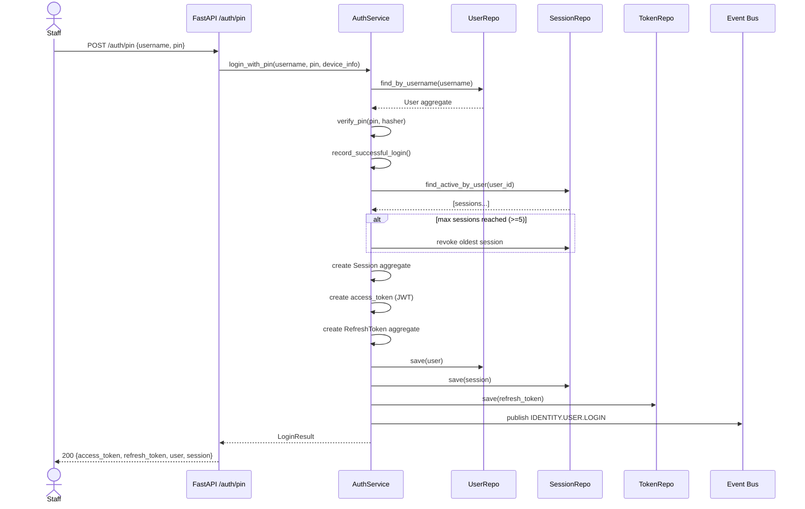
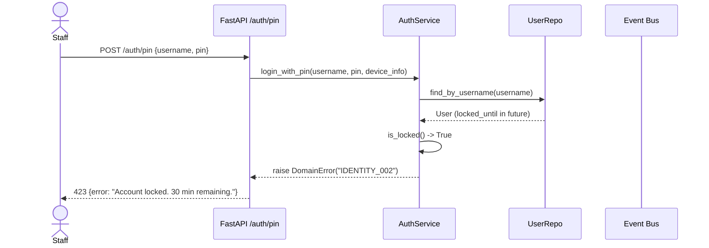
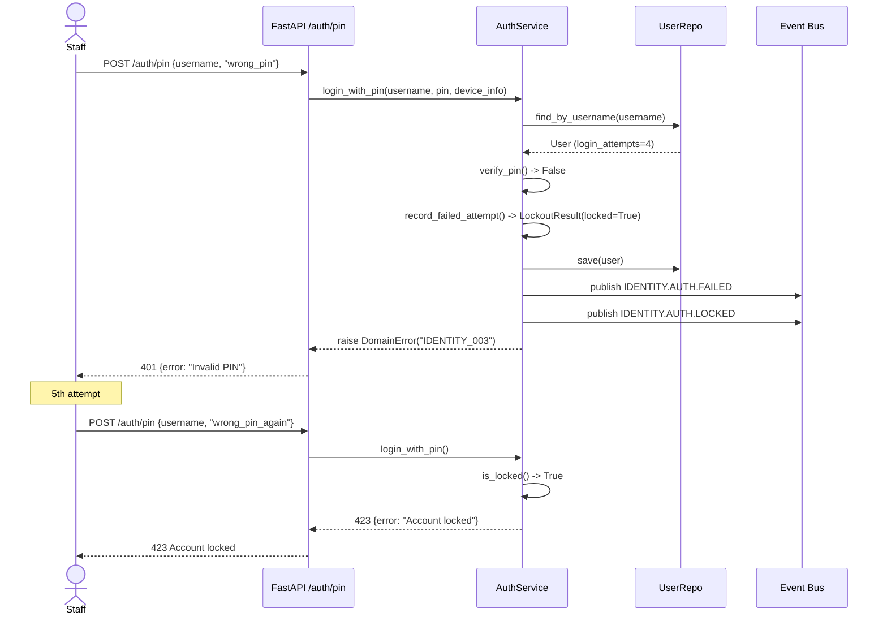
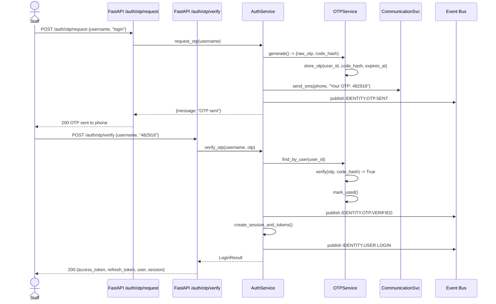
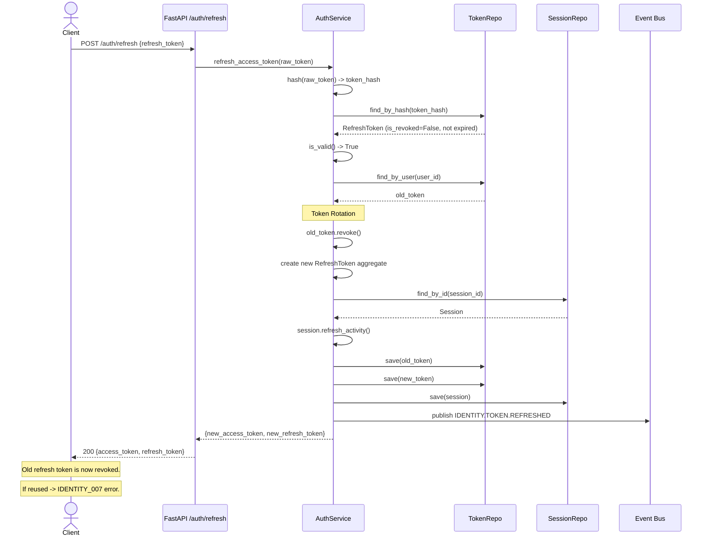
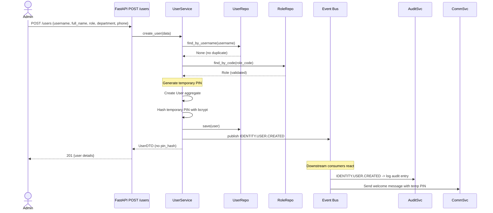

# 006 — Identity Engine: Sequence Diagrams

*6 critical flows visualized with Mermaid sequence diagrams.*

---

## Flow 1: PIN Login (Happy Path)

---

## Flow 2: PIN Login (Locked Account)

---

## Flow 3: PIN Login (Failed → Lockout)

---

## Flow 4: OTP Login (Full Flow)

---

## Flow 5: Token Refresh with Rotation

---

## Flow 6: Admin Creates User → Events Propagate

---

## 7. Validation Checklist

| Flow | Validates | Verified |
|---|---|---|
| 1. PIN Login Happy Path | PIN format, hash verify, session create, token issue, event publish | [ ] |
| 2. Locked Account | Lock detection, correct error code, no side effects | [ ] |
| 3. Failure → Lockout | Attempt count, threshold trigger, event sequence | [ ] |
| 4. OTP Flow | Generate, store, deliver, verify, login, events | [ ] |
| 5. Token Refresh | Rotation, revocation, activity refresh, replay protection | [ ] |
| 6. Admin Create User | Duplicate check, role validation, temp PIN, event | [ ] |
