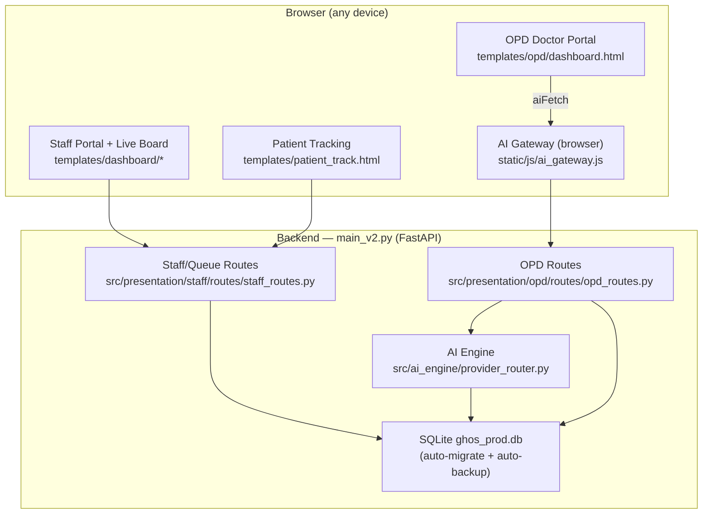
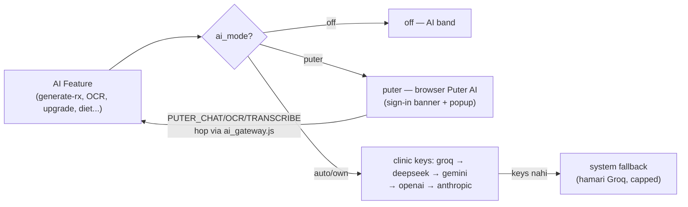
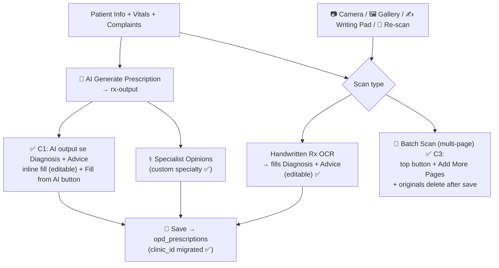
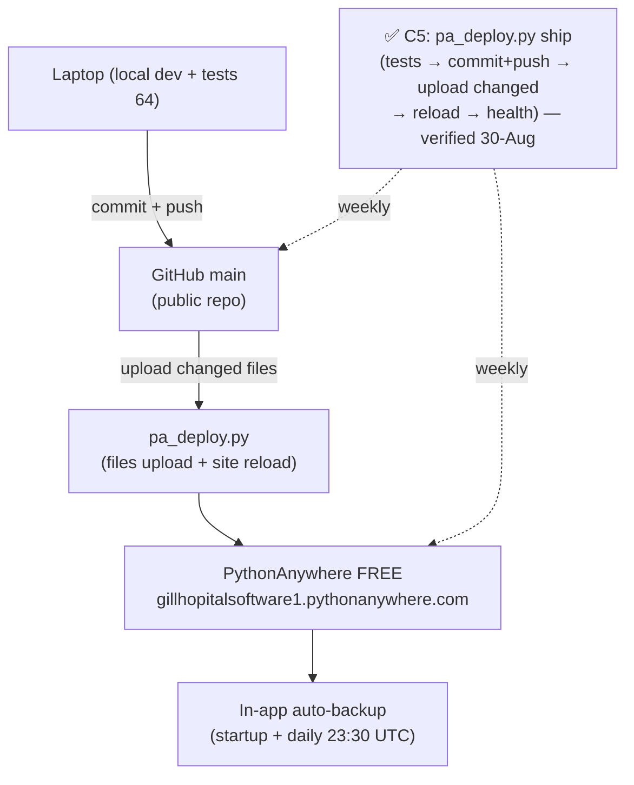
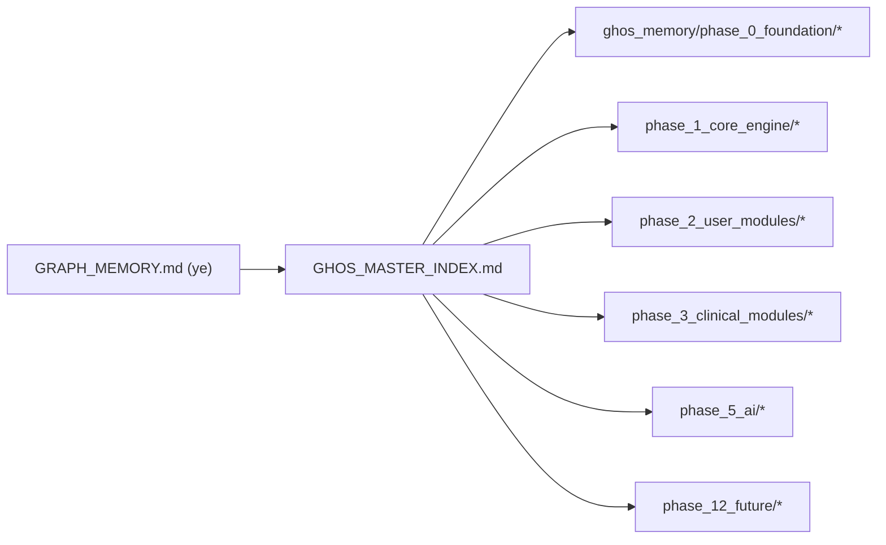

# GIL CLINIC — Graphical Project Memory (Knowledge Graph)
## v2 · 30-Aug-2026 · C1+C2+C3+C5 shipped · Live system state

> Ye file project ki memory ko **graphical form** mein rakhti hai — taaki koi bhi
> recording/feature kaam dubara na khoye (memory crash-proof). Har feature ship
> hone par ye graph update hota hai. Nodes ke neeche file-links hain.

---

## GRAPH 1 — System Architecture (Live)

## GRAPH 2 — AI Routing (BYOK → Puter → Fallback)

## GRAPH 3 — OPD Doctor Workflow (aaj + planned)

## GRAPH 4 — Deploy & Ship (live + weekly-ship plan)

## GRAPH 5 — Memory Map (ye file khud)

---

## Node → File Index (sab kuch ek jagah)

| Node | File |
|---|---|
| OPD Doctor Portal | `templates/opd/dashboard.html` |
| AI Gateway (browser) | `static/js/ai_gateway.js` |
| AI Router | `src/ai_engine/provider_router.py` |
| OPD Routes | `src/presentation/opd/routes/opd_routes.py` |
| Staff/Queue Routes | `src/presentation/staff/routes/staff_routes.py` |
| Auto-backup | `src/infrastructure/clinic/services/auto_backup.py` |
| DB migration (SQLite) | `main_v2.py` → `_migrate_sqlite_columns()` |
| Deploy driver | `pa_deploy.py` + `pa_requirements.txt` |
| PA deploy guide | `PA_DEPLOY_GUIDE.md` |
| Cloud deploy guide (Oracle) | `CLOUD_DEPLOY_GUIDE.md` + `deploy_oracle.sh` + `deploy_remote.ps1` |
| Upgradation plan | `PRODUCT_UPGRADATION_PUTER_PLAN.md` (PART C = 30-Aug upgrades) |
| Status trail | `SYSTEM_STATUS_REPORT.md` |

**Update rule:** koi bhi feature ship ho → ye graph + index update karo (recording kabhi na gume).
